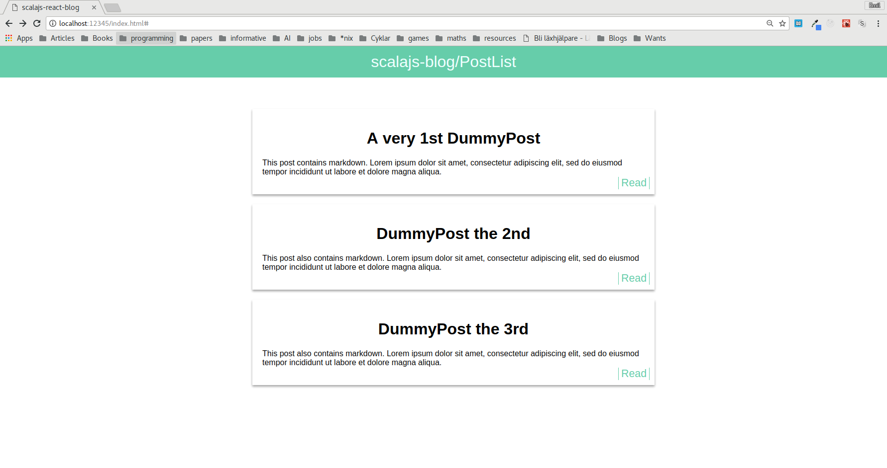
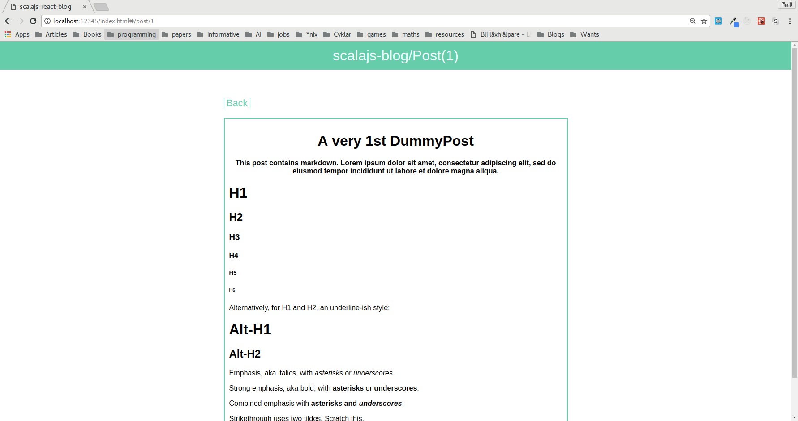

# scalajs-react-blog

## Development

1. `git clone`
2. cd into `repo-folder/api`
3. run `yarn install && yarn run`
    1. requires:
        1. Installed: `postgresql`
        2. User: `postgres`
        3. Initialized database: `glowing-potato-db`
        4. User and Database name can be configured in `repo-folder/api/src/main.js`
4. _optional:_ Database can be filled with dummy-data by running `node repo-folder/api/src/dummy.js`
5. run `sbt`, this will automatically set up a local development web-server (for routing)
6. run `~fastOptJS` in sbt for auto-compilation on changes
7. web-server reachable at [localhost:12345/index.html](http://localhost:12345/index.html)

## Render

